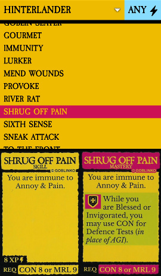

# Morbad Scorepad

This is a support app for the massively awesome **DUNGEON DEGENERATES:
HAND OF DOOM** boardgame; if you don't know what that is, you're in the
wrong place.  *(Like, in **life**.)*

This has two functional bits: the **Skill List** and the **Danger Deck**.
(Originally, I started writing this to record games in progress, but it
turns out that taking photos of the board & characters is pretty easy.)

For notes on checking out & building the code, see
[CONTRIBUTING](CONTRIBUTING.md).

Note that this contains massive amounts of graphics & text which **are
not mine;** it's all owned by GOBLINKO.

### Choose your expansions!

First, open Settings (the wrench-button-thing) and select the expansions
you're  using; this will determine which adventurers, cards, etc. are
available.

### Skill List

This shows the fronts & backs of the available skills for a given
adventurer.  If everyone at the table has a device with the app,
then no one has to sit around waiting for someone to finish looking at
the skill deck.

### Danger Deck

This keeps track of the Danger deck, so you never have to shuffle it
yourself.  Some features:

- When the primary card is drawn, a reading of the card is played aloud.
  (This can be turned off in Settings.  Even when sound is turned off,
  you can tap on a card to hear its sound.  See
  [here](https://github.com/kuhrusty/MorbadScorepad/blob/master/CONTRIBUTING.md#adding-your-own-danger-card-recordings)
  for instructions on adding your own recordings!)
- You can **undo & redo** card draws and shuffles.
- Deck state is remembered across app restarts.
- In Settings, there's an option to disable the primary draw button
  until you confirm that you've updated danger levels on the map after
  fights, in case you sometimes forget to do that.

See the in-app help for more information.

